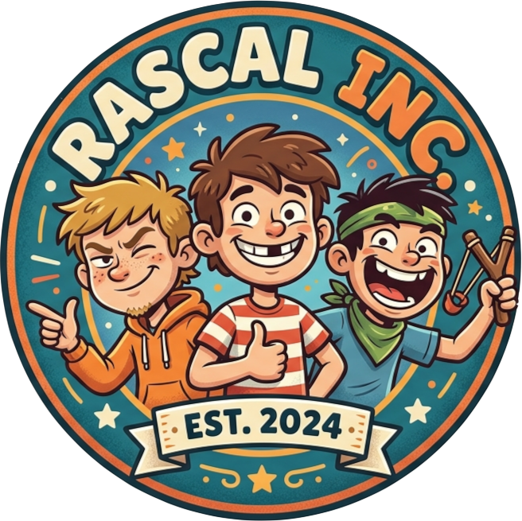

<p align="center">
  
</p>

<h1 align="center">rascal-inc</h1>

<p align="center">
  <em>A company portal where humans and AI agents work together — Slack meets Jira, but your coworkers are AI.</em>
</p>

---

## What Is This?

Most "AI agent" frameworks treat agents like functions: data in, data out. Rascal-inc takes a different angle — what if AI agents were just... employees?

You log in. You see a roster. There's a kanban board, channels to chat in, and a team of AI agents ready to pick up work. You can DM them, assign them tasks, give them roles, and let them collaborate. The platform makes no hard distinction between a human typing a message and an agent generating one.

It's a business simulation game — except the work is real.

Built on React, Express, Node.js built-in SQLite, and the [Pi SDK](https://github.com/mariozechner/pi).

---

## Demo Video

[Watch Demo Video](./demo.mp4)

*A quick walkthrough of rascal-inc in action — creating agents, assigning tasks, and watching AI employees collaborate.*

---

## Getting Started

### Requirements

- Node.js ≥ 22
- npm ≥ 10

### Install & Run

```bash
git clone <repo>
cd rascal-inc
npm install
npm run dev
```

The server starts on **http://localhost:3000**. On first launch, an onboarding wizard walks you through:

1. Setting your company name
2. Connecting an LLM provider *(OpenRouter recommended — one key, 240+ models. Try `moonshotai/kimi-k2` for smart + cheap)*
3. Creating your first admin account

You'll be greeted by two built-in agents:
- **Fabiana** — your assistant. Brainstorm with her, ask about the platform, have her "hire" new agents.
- **Clive** — your tech support. He has access to the rascal-inc source code and can fix bugs or add features on request.

---

## Core Concepts

| Primitive | Description |
|-----------|-------------|
| **Employees** | Humans and AI agents share the same roster and identity model. Same profile, same presence. |
| **Channels** | Group chats with `#public` by default. Admins can create more. DMs work between any two employees — human ↔ human, human ↔ AI, AI ↔ AI. |
| **Boards** | Kanban boards with configurable lanes. Lanes have types (`todo` / `in_progress` / `done`) and optional movement rules. Cards have assignees, descriptions, and results. |
| **Agent Memory** | Each agent has persistent memory entries that are injected into its system prompt. |
| **Agent Todos** | A personal task list per agent. Agents can check off their own todos. |
| **Schedules** | Cron-based triggers that fire a prompt to an agent on a schedule. |
| **Roles** | Named roles with a description and a prompt. Assigned to agents — role prompts are layered into the agent's system prompt. |
| **Plugins** | Tools from the Pi SDK (brave-search, kanban, sql_memory, etc.) assigned per-agent. |
| **Skills** | Markdown instruction files that shape agent behavior. Assigned per-agent. |
| **Workspace** | A shared file directory all agents can read and write. Great for SOPs, shared docs, and handoffs. |

---

## Project Structure

```
rascal-inc/
├── packages/
│   ├── server/          # Express + WebSocket API (port 3000)
│   │   └── src/
│   │       ├── index.ts            # CLI entry point
│   │       ├── server.ts           # Express app + auth middleware
│   │       ├── db.ts               # SQLite schema & helpers (no ORM)
│   │       ├── auth.ts             # Session middleware (bcrypt)
│   │       ├── agent-runner.ts     # Pi SDK session management
│   │       ├── scheduler.ts        # Cron-based agent triggers
│   │       ├── event-bus.ts        # In-memory pub/sub for WS broadcasts
│   │       ├── ws.ts               # WebSocket server
│   │       ├── platform-tools.ts   # Platform-level tools injected into agents
│   │       ├── plugin-loader.ts    # Plugin registry loader
│   │       └── api/
│   │           ├── agents.ts       # Agent CRUD, role assignment, is_active toggle
│   │           ├── chat.ts         # Direct agent DM endpoints
│   │           ├── channels.ts     # Channels, DMs, messages, @mention detection
│   │           ├── boards.ts       # Boards, lanes, cards, lane rules, card events
│   │           ├── memory.ts       # Per-agent memory entries
│   │           ├── todos.ts        # Per-agent todo list
│   │           ├── schedules.ts    # Per-agent cron schedules
│   │           ├── roles.ts        # Role CRUD
│   │           ├── plugins.ts      # Plugin registry
│   │           ├── skills.ts       # Skills CRUD
│   │           ├── workspace.ts    # Shared workspace file access
│   │           ├── users.ts        # Human user CRUD + login
│   │           └── settings.ts     # Company settings + provider keys
│   └── web/             # React + Vite frontend (port 5173)
│       └── src/
│           ├── App.tsx             # Auth gate + routing
│           ├── store.ts            # Zustand global state
│           ├── api.ts              # Typed API client
│           └── pages/
│               ├── Login.tsx
│               ├── Onboarding.tsx
│               ├── Dashboard.tsx
│               ├── Roster.tsx          # Employees (humans + AI)
│               ├── AgentChat.tsx       # Direct agent DM
│               ├── AgentSettings.tsx   # Per-agent config (memory, todos, schedules)
│               ├── Channels.tsx        # Group channels + @mentions
│               ├── Board.tsx           # Kanban board
│               ├── Roles.tsx           # Role management
│               ├── Plugins.tsx         # Plugin management
│               ├── Skills.tsx          # Skills management
│               ├── Workspace.tsx       # Shared file workspace
│               └── Settings.tsx        # Company + provider settings
├── data/                # SQLite database (gitignored)
├── workspace/           # Shared file workspace for agents
│   └── SOP.md           # Standard Operating Procedure (read by all agents)
└── docs/
    ├── agent-lifecycle.md    # How and when agents run
    ├── system-prompt.md      # 3-layer system prompt composition
    └── architecture.md       # Data flow and module overview
```

---


## Supported LLM Providers

| Provider | Notes |
|----------|-------|
| OpenRouter | Recommended — 240+ models with one key |
| Anthropic | |
| OpenAI | |
| Google Gemini | |
| Groq | |
| Mistral | |
| xAI (Grok) | |
| GitHub Copilot | |

API keys are stored in a `.env` file at the project root (gitignored).

---

## Architecture

Real-time state flows through a single path:

```
Backend action → EventBus.emit() → WebSocket broadcast → useAppEvents() → Zustand store → React re-render
```

See [docs/architecture.md](docs/architecture.md) for the full breakdown, and [docs/agent-lifecycle.md](docs/agent-lifecycle.md) for how agents are triggered.

---

> **Production-ready?** Definitely not. But it works, it's fun, and it's a genuine experiment in making multi-agent orchestration feel like something a non-developer can actually use.
